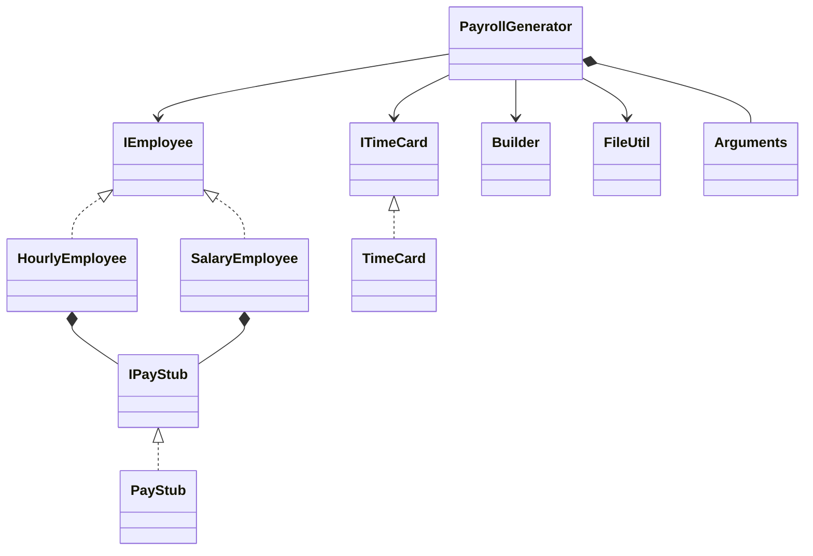
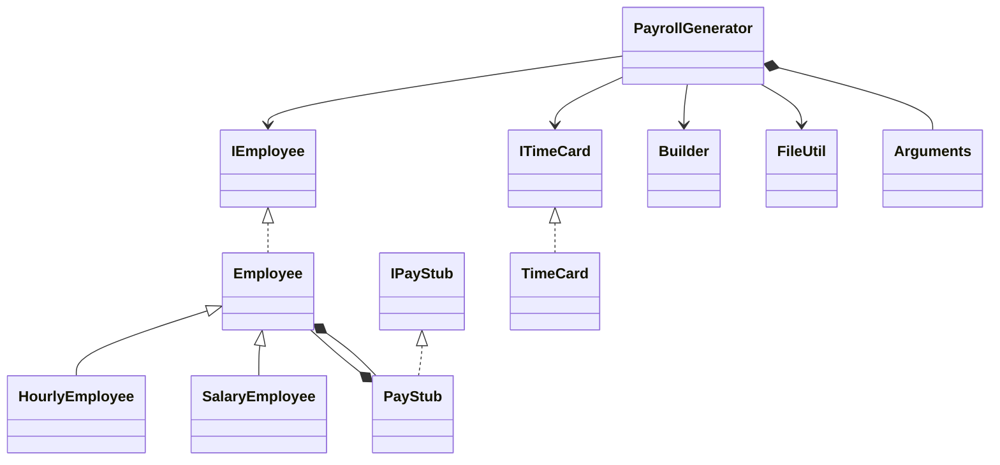
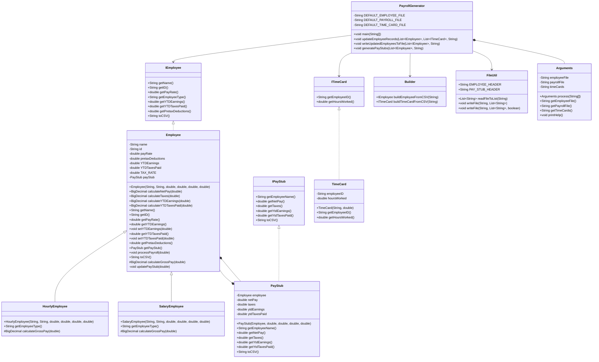

# Payroll Generator Design Document

This document is meant to provide a tool for you to demonstrate the design process. You need to work on this before you code, and after have a finished product. That way you can compare the changes, and changes in design are normal as you work through a project. It is contrary to popular belief, but we are not perfect our first attempt. We need to iterate on our designs to make them better. This document is a tool to help you do that.

## (INITIAL DESIGN): Class Diagram

Place your class diagram below. Make sure you check the fil in the browser on github.com to make sure it is rendering correctly. If it is not, you will need to fix it. As a reminder, here is a link to tools that can help you create a class diagram: [Class Resources: Class Design Tools](https://github.com/CS5004-khoury-lionelle/Resources?tab=readme-ov-file#uml-design-tools)

As shown in the initial design UML above, we have the following relationships between the classes.
* `PayrollGenerator` has a composition relationship with `Arguments` (`Arguments` is an inner class of `PayrollGenerator`).
* `PayrollGenerator` has dependence relationships with the two utility classes `FileUtil` and `Builder` (`PayrollGenerator` uses these utility classes).
* `PayrollGenerator` has dependence relationships with the `IEmployee` and `ITimeCard` classes (`PayrollGenerator` also uses these classes).
* `TimeCard` implements `ITimeCard` interface.
* `HourlyEmployee` and `SalaryEmployee` both implement the `IEmployee` interface.
* `PayStub` implements `IPayStub` interface.
* `HourlyEmployee` and `SalaryEmployee` both have a composition relationship with `IPayStub`.

## (INITIAL DESIGN): Tests to Write - Brainstorm

Write a test (in english) that you can picture for the class diagram you have created. This is the brainstorming stage in the TDD process.

> [!TIP]
> As a reminder, this is the TDD process we are following:
> 1. Figure out a number of tests by brainstorming (this step)
> 2. Write **one** test
> 3. Write **just enough** code to make that test pass
> 4. Refactor/update  as you go along
> 5. Repeat steps 2-4 until you have all the tests passing/fully built program

You should feel free to number your brainstorm.

1. testCalculateNetPay() properly calculates the net pay
2. testCalculateTaxes() properly calculates the taxes
3. testCalculateYTDEarnings() properly calculates the ytdEarnings
4. testCalculateYTDTaxesPaid() properly calculates the ytdTaxesPaid
5. testProcessPayroll() properly processes the payroll
6. testToCSV() returns the correct CSV string.

## (FINAL DESIGN): Class Diagram

Go through your completed code, and update your class diagram to reflect the final design. Make sure you check the file in the browser on github.com to make sure it is rendering correctly. It is normal that the two diagrams don't match! Rarely (though possible) is your initial design perfect.

The simplified UML representing the relationships between the classes of the final design is shown below.

The major change in the final design compared to the initial design is that an abstract class `Employee` is added between the `IEmployee` interface and
the concrete classes of `HourlyEmployee` and `SalaryEmployee`. The benefits of doing so include improved code reusability, maintainability, and ensured
uniform behavior.

The final design with all the detailed attributes and methods are shown below.

> [!WARNING]
> If you resubmit your assignment for manual grading, this is a section that often needs updating. You should double check with every resubmit to make sure it is up to date.

## (FINAL DESIGN): Reflection/Retrospective

> [!IMPORTANT]
> The value of reflective writing has been highly researched and documented within computer science, from learning new information to showing higher salaries in the workplace. For this next part, we encourage you to take time, and truly focus on your retrospective.

Take time to reflect on how your design has changed. Write in *prose* (i.e. do not bullet point your answers - it matters in how our brain processes the information). Make sure to include what were some major changes, and why you made them. What did you learn from this process? What would you do differently next time? What was the most challenging part of this process? For most students, it will be a paragraph or two.

Initially, the design has two concrete classes, one representing the hourly employee and the other the salary employee, implement the `IEmployee` interface directly and overriding the methods defined in the interface.
However, during the development process, it quickly became clear that there need to be an abstract parent class to reduce the amounts of repeated codes that are the same for these two subclasses, and there needs to be
an abstract method in the parent class to specify the methods that are implemented differently in these subclasses.

In fact, the only method that needs to be implemented differently for `HourlyEmployee` and `SalaryEmployee` is the method to calculate the gross pay. Therefore, the design had an abstract method, calculateGrossPay,
defined in the parent class `Employee` and the concrete methods implemented in the two subclasses.

The main take-away from this change in design is that an abstract class could server as a great intermediary between an interface and the concrete classes of different subtypes to promote a clearer code hierarchy and
make the code cleaner.